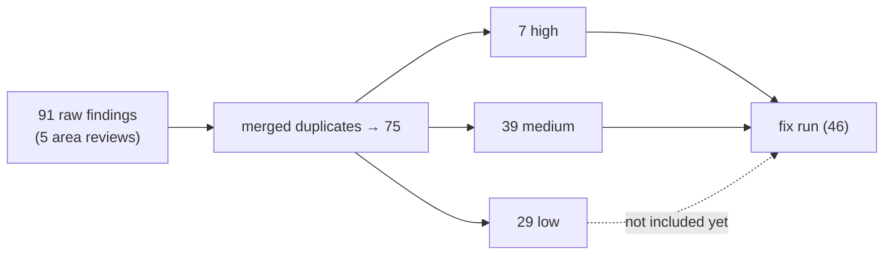

# flowchart

Captured 2026-11-19T09:34:24.479Z - run r-20261119-095449-ea8e

```mermaid
flowchart LR
  R["91 raw findings<br/>(5 area reviews)"] --> M["merged duplicates → 75"]
  M --> H["7 high"] & Md["39 medium"] & L["29 low"]
  H & Md --> F["fix run (46)"]
  L -.->|"not included yet"| F
```
