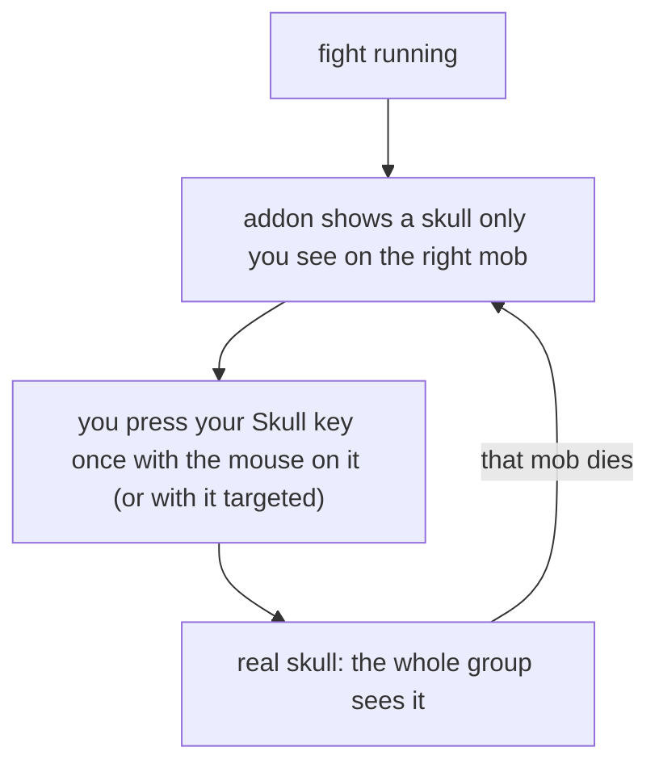

# flowchart

Captured 2026-11-19T10:14:02.339Z - run r-20261119-111347-5e2e

```mermaid
flowchart TD
    Fight[fight running] --> Hint["addon shows a skull only you see on the right mob"]
    Hint --> Press["you press your Skull key once with the mouse on it (or with it targeted)"]
    Press --> Real[real skull: the whole group sees it]
    Real -->|that mob dies| Hint
```
