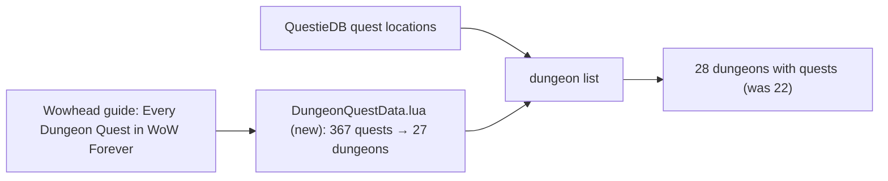

# flowchart

Captured 2026-11-19T14:55:29.834Z - run r-20261119-154920-9f41

```mermaid
flowchart LR
    W["Wowhead guide: Every Dungeon Quest in WoW Forever"] --> F["DungeonQuestData.lua (new): 367 quests → 27 dungeons"]
    Q["QuestieDB quest locations"] --> M[dungeon list]
    F --> M
    M --> R["28 dungeons with quests (was 22)"]
```
