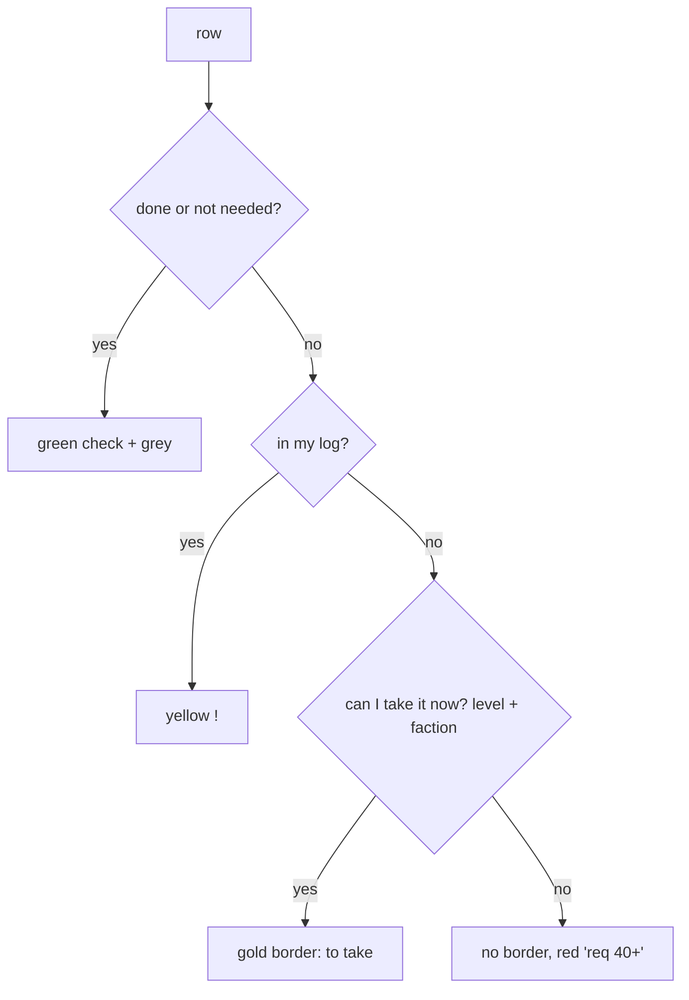

# flowchart

Captured 2026-11-19T08:57:36.483Z - run r-20261119-095324-f651

```mermaid
flowchart TD
    R[row] --> D{done or not needed?}
    D -- yes --> T[green check + grey]
    D -- no --> L{in my log?}
    L -- yes --> E["yellow !"]
    L -- no --> C{"can I take it now? level + faction"}
    C -- yes --> B["gold border: to take"]
    C -- no --> N["no border, red 'req 40+'"]
```
