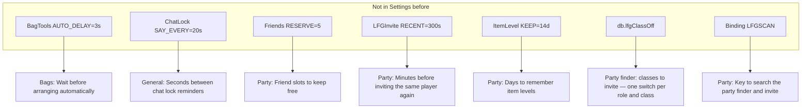

# flowchart

Captured 2026-11-19T08:38:48.557Z - run r-20261119-093204-ad13

```mermaid
flowchart TD
    subgraph Before["Not in Settings before"]
        A[BagTools AUTO_DELAY=3s] 
        B[ChatLock SAY_EVERY=20s]
        C[Friends RESERVE=5]
        D[LFGInvite RECENT=300s]
        E[ItemLevel KEEP=14d]
        F[db.lfgClassOff]
        G[Binding LFGSCAN]
    end
    A --> S1[Bags: Wait before arranging automatically]
    B --> S2[General: Seconds between chat lock reminders]
    C --> S3[Party: Friend slots to keep free]
    D --> S4[Party: Minutes before inviting the same player again]
    E --> S5[Party: Days to remember item levels]
    F --> S6[Party finder: classes to invite — one switch per role and class]
    G --> S7[Party: Key to search the party finder and invite]
```
