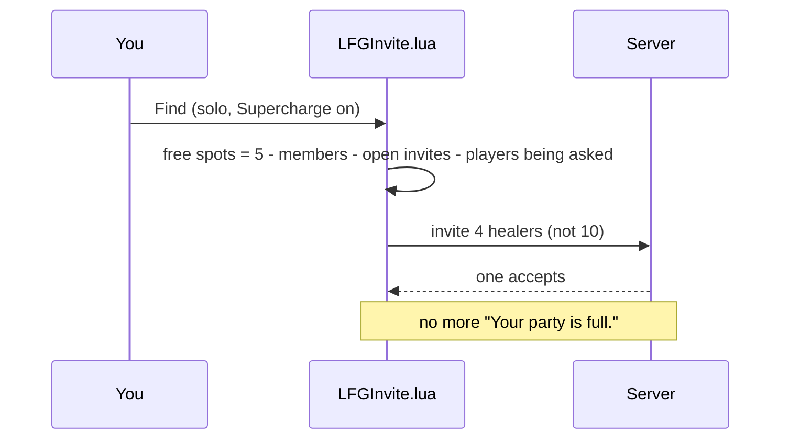

# sequenceDiagram

Captured 2026-11-19T17:35:08.615Z - run r-20261119-183049-cfdd

```mermaid
sequenceDiagram
    participant You
    participant Addon as LFGInvite.lua
    participant Server
    You->>Addon: Find (solo, Supercharge on)
    Addon->>Addon: free spots = 5 - members - open invites - players being asked
    Addon->>Server: invite 4 healers (not 10)
    Server-->>Addon: one accepts
    Note over Addon,Server: no more "Your party is full."
```
