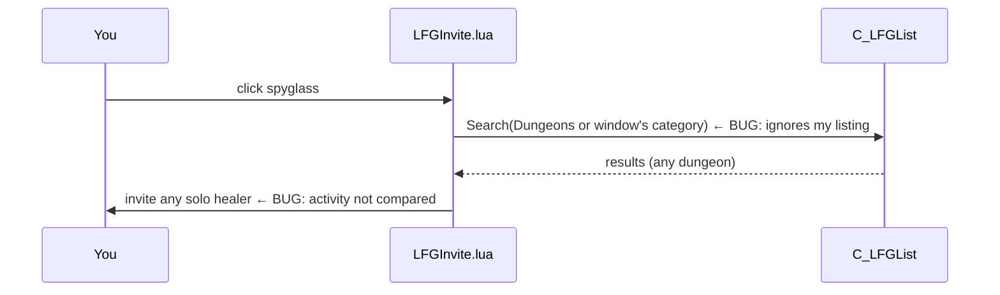
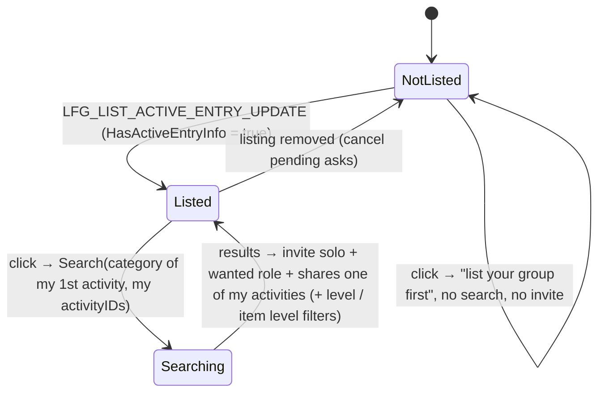

# sequenceDiagram

Captured 2026-11-19T08:10:13.953Z - run r-20261119-090926-e18a

## sequenceDiagram

```mermaid
sequenceDiagram
    participant You
    participant L as LFGInvite.lua
    participant API as C_LFGList
    You->>L: click spyglass
    L->>API: Search(Dungeons or window's category)  ← BUG: ignores my listing
    API-->>L: results (any dungeon)
    L->>You: invite any solo healer  ← BUG: activity not compared
```

## stateDiagram-v2

```mermaid
stateDiagram-v2
    [*] --> NotListed
    NotListed --> Listed : LFG_LIST_ACTIVE_ENTRY_UPDATE (HasActiveEntryInfo = true)
    Listed --> NotListed : listing removed (cancel pending asks)
    NotListed --> NotListed : click → "list your group first", no search, no invite
    Listed --> Searching : click → Search(category of my 1st activity, my activityIDs)
    Searching --> Listed : results → invite solo + wanted role + shares one of my activities (+ level / item level filters)
```
