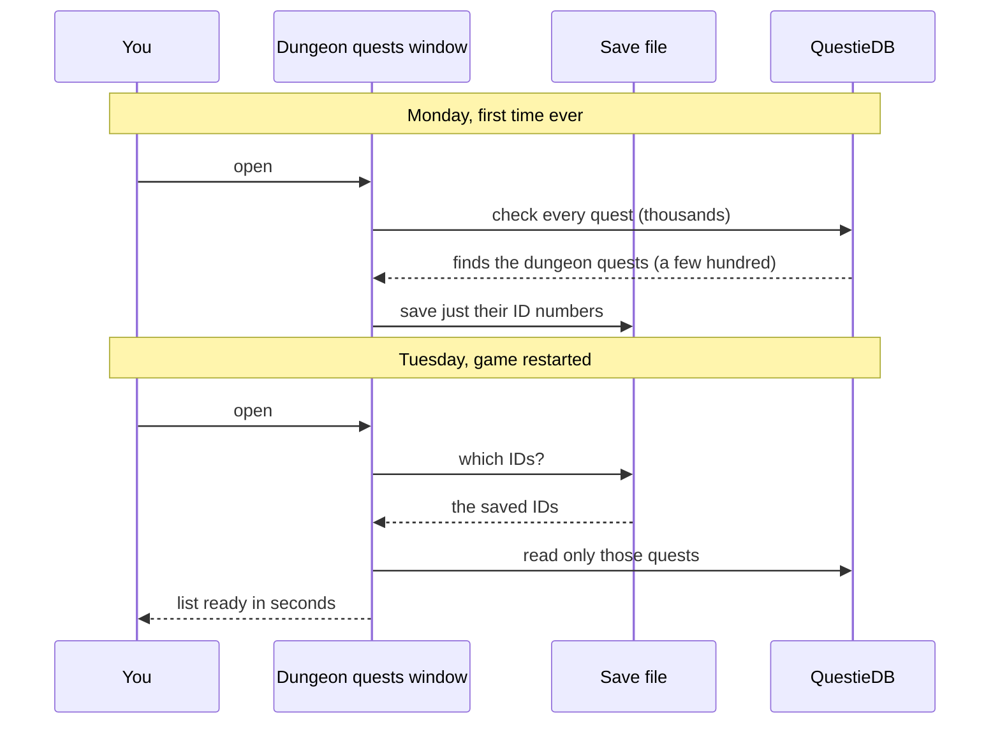

# sequenceDiagram

Captured 2026-11-19T10:50:36.573Z - run r-20261119-113937-c955

```mermaid
sequenceDiagram
    participant You
    participant DQ as Dungeon quests window
    participant Disk as Save file
    participant DB as QuestieDB
    Note over You,DB: Monday, first time ever
    You->>DQ: open
    DQ->>DB: check every quest (thousands)
    DB-->>DQ: finds the dungeon quests (a few hundred)
    DQ->>Disk: save just their ID numbers
    Note over You,DB: Tuesday, game restarted
    You->>DQ: open
    DQ->>Disk: which IDs?
    Disk-->>DQ: the saved IDs
    DQ->>DB: read only those quests
    DQ-->>You: list ready in seconds
```
