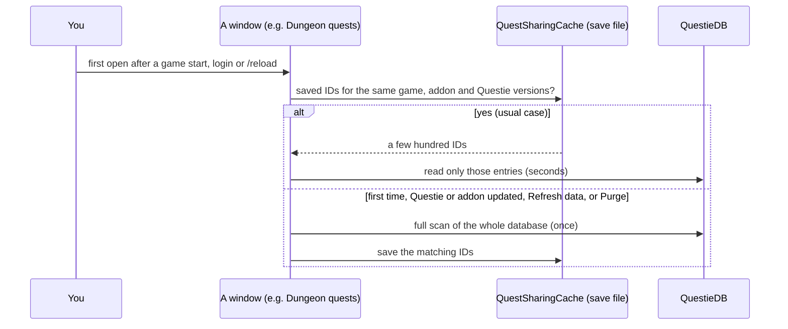

# sequenceDiagram

Captured 2026-11-19T10:40:06.761Z - run r-20261119-112648-e332

```mermaid
sequenceDiagram
    participant You
    participant Win as A window (e.g. Dungeon quests)
    participant Disk as QuestSharingCache (save file)
    participant DB as QuestieDB
    You->>Win: first open after a game start, login or /reload
    Win->>Disk: saved IDs for the same game, addon and Questie versions?
    alt yes (usual case)
        Disk-->>Win: a few hundred IDs
        Win->>DB: read only those entries (seconds)
    else first time, Questie or addon updated, Refresh data, or Purge
        Win->>DB: full scan of the whole database (once)
        Win->>Disk: save the matching IDs
    end
```
