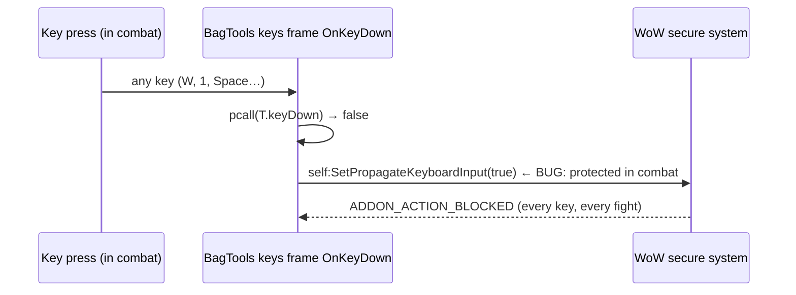
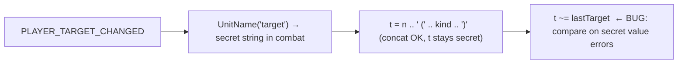

# sequenceDiagram

Captured 2026-11-19T08:23:04.302Z - run r-20261119-092207-6eee

## sequenceDiagram

```mermaid
sequenceDiagram
    participant Player as Key press (in combat)
    participant Keys as BagTools keys frame OnKeyDown
    participant Game as WoW secure system
    Player->>Keys: any key (W, 1, Space…)
    Keys->>Keys: pcall(T.keyDown) → false
    Keys->>Game: self:SetPropagateKeyboardInput(true)  ← BUG: protected in combat
    Game-->>Keys: ADDON_ACTION_BLOCKED (every key, every fight)
```

## flowchart

```mermaid
flowchart LR
    E[PLAYER_TARGET_CHANGED] --> N["UnitName('target') → secret string in combat"]
    N --> C["t = n .. ' (' .. kind .. ')'  (concat OK, t stays secret)"]
    C --> X["t ~= lastTarget  ← BUG: compare on secret value errors"]
```
