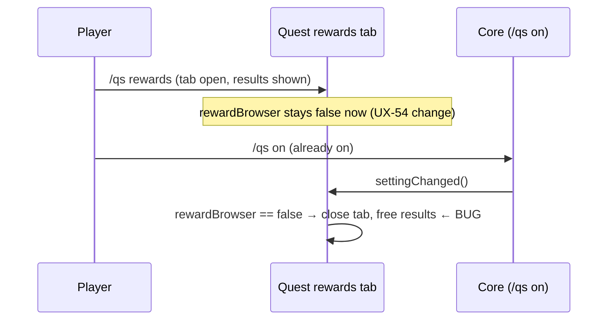
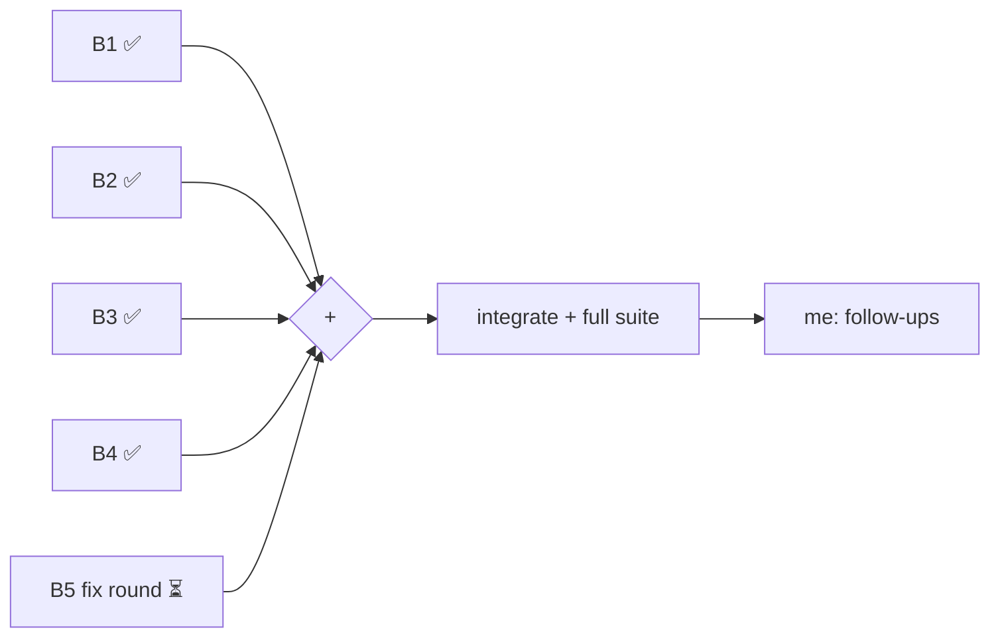

# sequenceDiagram

Captured 2026-11-19T10:53:27.350Z - run r-20261119-113937-c955

## sequenceDiagram

```mermaid
sequenceDiagram
    participant P as Player
    participant R as Quest rewards tab
    participant C as Core (/qs on)
    P->>R: /qs rewards (tab open, results shown)
    Note over R: rewardBrowser stays false now (UX-54 change)
    P->>C: /qs on (already on)
    C->>R: settingChanged()
    R->>R: rewardBrowser == false → close tab, free results  ← BUG
```

## flowchart

```mermaid
flowchart LR
  B1["B1 ✅"] --> J{"+"}
  B2["B2 ✅"] --> J
  B3["B3 ✅"] --> J
  B4["B4 ✅"] --> J
  B5["B5 fix round ⏳"] --> J
  J --> I["integrate + full suite"] --> M["me: follow-ups"]
```
