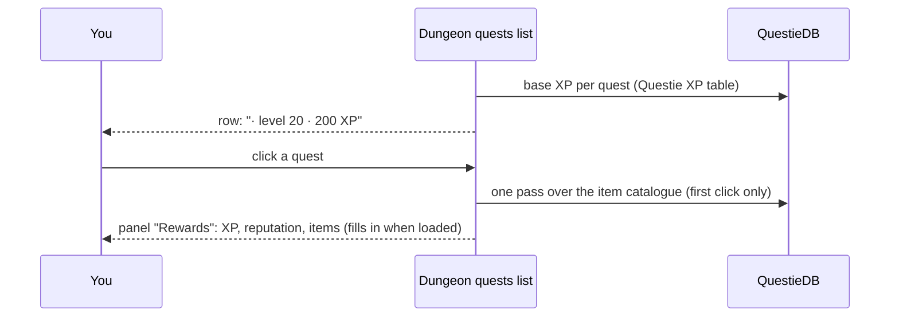

# sequenceDiagram

Captured 2026-11-19T09:21:22.815Z - run r-20261119-095449-ea8e

```mermaid
sequenceDiagram
    participant You
    participant List as Dungeon quests list
    participant DB as QuestieDB
    List->>DB: base XP per quest (Questie XP table)
    List-->>You: row: "· level 20 · 200 XP"
    You->>List: click a quest
    List->>DB: one pass over the item catalogue (first click only)
    List-->>You: panel "Rewards": XP, reputation, items (fills in when loaded)
```
