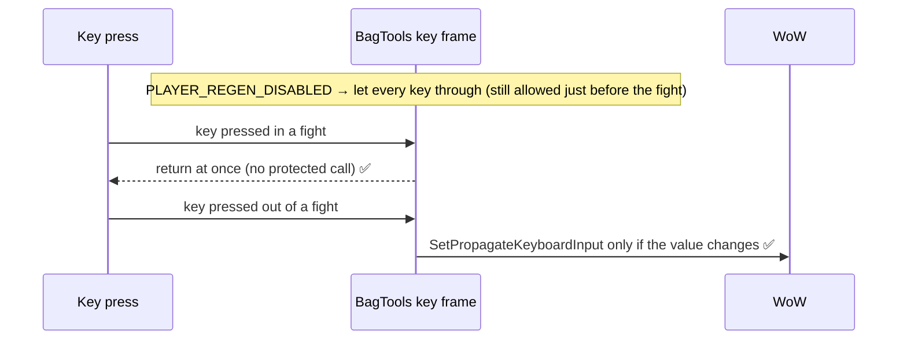

# sequenceDiagram

Captured 2026-11-19T08:32:31.523Z - run r-20261119-092849-1081

```mermaid
sequenceDiagram
    participant Key as Key press
    participant Keys as BagTools key frame
    participant Game as WoW
    Note over Keys: PLAYER_REGEN_DISABLED → let every key through (still allowed just before the fight)
    Key->>Keys: key pressed in a fight
    Keys-->>Key: return at once (no protected call) ✅
    Key->>Keys: key pressed out of a fight
    Keys->>Game: SetPropagateKeyboardInput only if the value changes ✅
```
