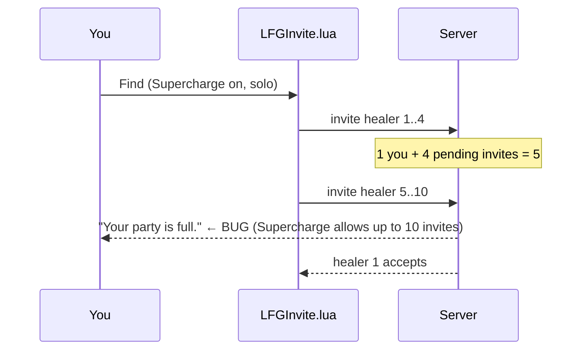

# sequenceDiagram

Captured 2026-11-19T16:30:23.100Z - run r-20261119-172930-eefc

```mermaid
sequenceDiagram
    participant You
    participant Addon as LFGInvite.lua
    participant Server
    You->>Addon: Find (Supercharge on, solo)
    Addon->>Server: invite healer 1..4
    Note over Server: 1 you + 4 pending invites = 5
    Addon->>Server: invite healer 5..10
    Server-->>You: "Your party is full." ← BUG (Supercharge allows up to 10 invites)
    Server-->>Addon: healer 1 accepts
```
