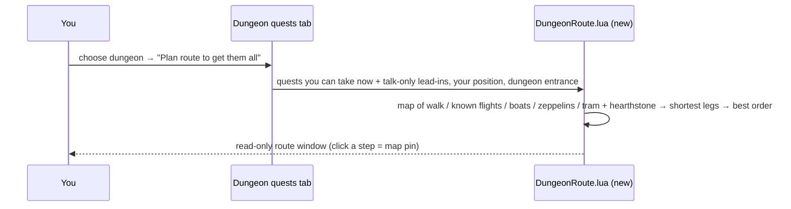

# sequenceDiagram

Captured 2026-11-19T10:29:58.823Z - run r-20261119-111105-878a

```mermaid
sequenceDiagram
    participant You
    participant DQ as Dungeon quests tab
    participant R as DungeonRoute.lua (new)
    You->>DQ: choose dungeon → "Plan route to get them all"
    DQ->>R: quests you can take now + talk-only lead-ins, your position, dungeon entrance
    R->>R: map of walk / known flights / boats / zeppelins / tram + hearthstone → shortest legs → best order
    R-->>You: read-only route window (click a step = map pin)
```
