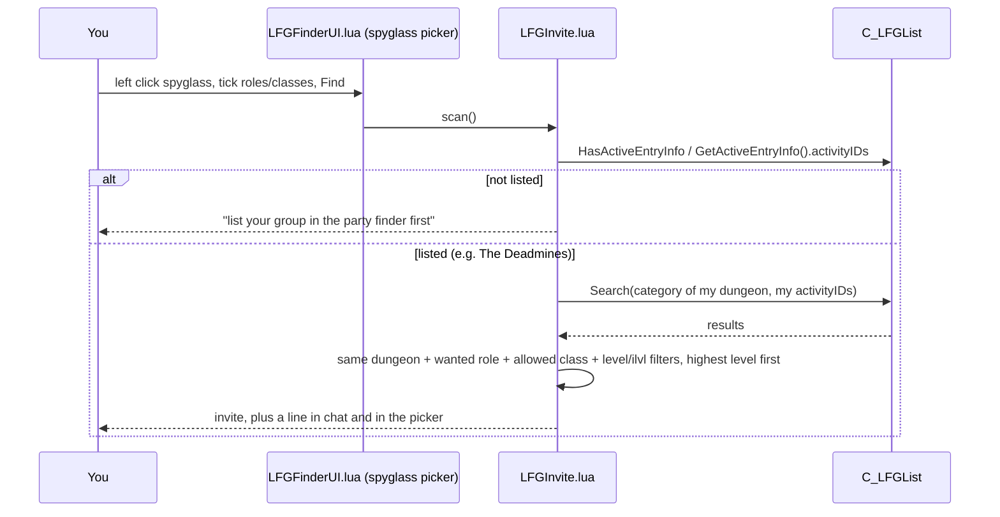

# sequenceDiagram

Captured 2026-11-19T08:24:10.657Z - run r-20261119-091837-8d36

```mermaid
sequenceDiagram
    participant You
    participant UI as LFGFinderUI.lua (spyglass picker)
    participant L as LFGInvite.lua
    participant API as C_LFGList
    You->>UI: left click spyglass, tick roles/classes, Find
    UI->>L: scan()
    L->>API: HasActiveEntryInfo / GetActiveEntryInfo().activityIDs
    alt not listed
        L-->>You: "list your group in the party finder first"
    else listed (e.g. The Deadmines)
        L->>API: Search(category of my dungeon, my activityIDs)
        API-->>L: results
        L->>L: same dungeon + wanted role + allowed class + level/ilvl filters, highest level first
        L-->>You: invite, plus a line in chat and in the picker
    end
```
