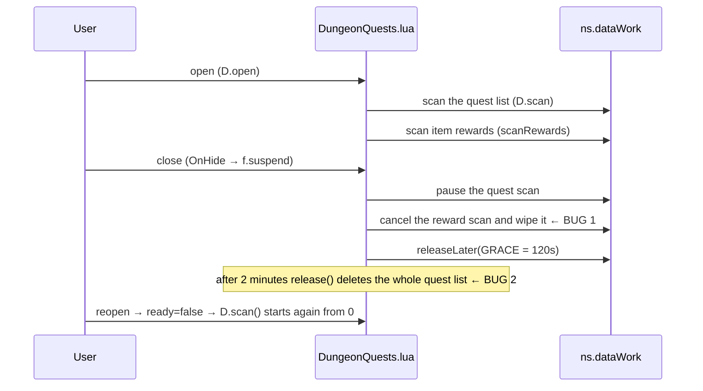

# sequenceDiagram

Captured 2026-11-19T09:29:49.428Z - run r-20261119-095449-ea8e

```mermaid
sequenceDiagram
    participant User
    participant DQ as DungeonQuests.lua
    participant Work as ns.dataWork
    User->>DQ: open (D.open)
    DQ->>Work: scan the quest list (D.scan)
    DQ->>Work: scan item rewards (scanRewards)
    User->>DQ: close (OnHide → f.suspend)
    DQ->>Work: pause the quest scan
    DQ->>Work: cancel the reward scan and wipe it ← BUG 1
    DQ->>Work: releaseLater(GRACE = 120s)
    Note over DQ: after 2 minutes release() deletes the whole quest list ← BUG 2
    User->>DQ: reopen → ready=false → D.scan() starts again from 0
```
