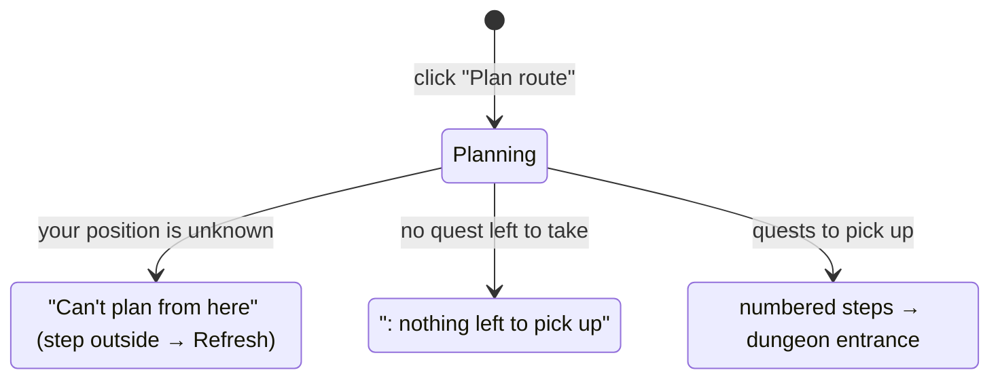

# stateDiagram-v2

Captured 2026-11-19T10:50:15.318Z - run r-20261119-113937-c955

```mermaid
stateDiagram-v2
    [*] --> Planning: click "Plan route"
    Planning --> NoStart: your position is unknown
    Planning --> Nothing: no quest left to take
    Planning --> Route: quests to pick up
    NoStart: "Can't plan from here" (step outside → Refresh)
    Nothing: "<dungeon>: nothing left to pick up"
    Route: numbered steps → dungeon entrance
```
