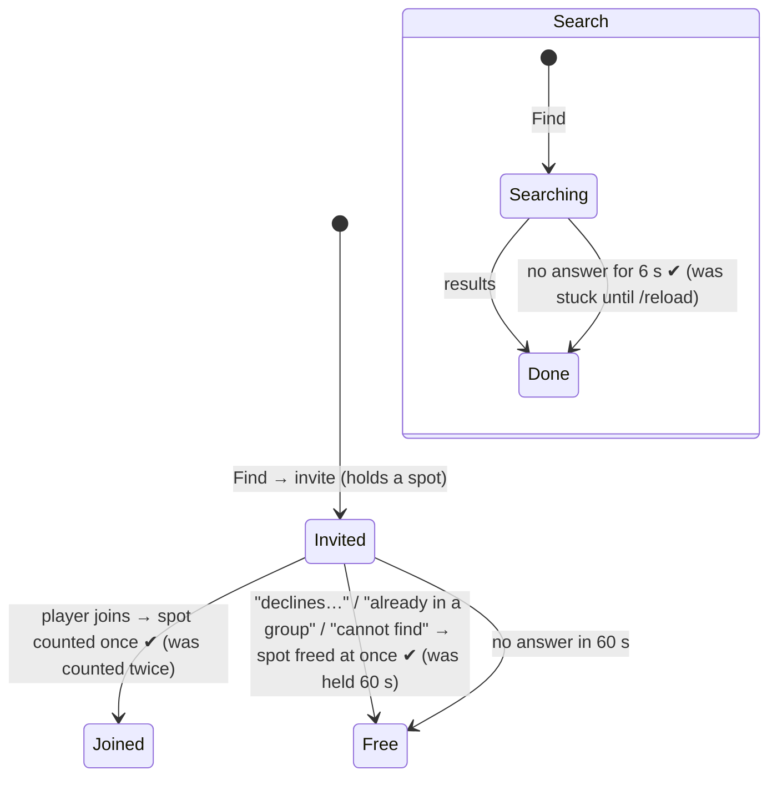

# stateDiagram-v2

Captured 2026-11-19T08:32:14.169Z - run r-20261119-092713-7da5

```mermaid
stateDiagram-v2
    [*] --> Invited : Find → invite (holds a spot)
    Invited --> Joined : player joins → spot counted once ✔ (was counted twice)
    Invited --> Free : "declines…" / "already in a group" / "cannot find" → spot freed at once ✔ (was held 60 s)
    Invited --> Free : no answer in 60 s
    state Search {
        [*] --> Searching : Find
        Searching --> Done : results
        Searching --> Done : no answer for 6 s ✔ (was stuck until /reload)
    }
```
