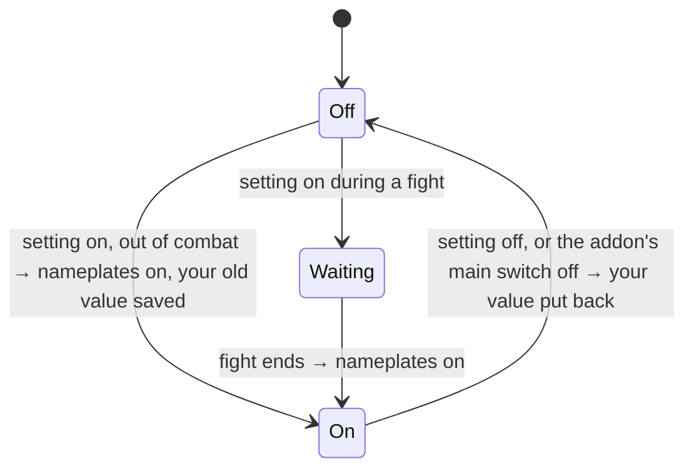

# stateDiagram-v2

Captured 2026-11-19T08:32:33.724Z - run r-20261119-092909-cb52

```mermaid
stateDiagram-v2
    [*] --> Off
    Off --> On : setting on, out of combat → nameplates on, your old value saved
    Off --> Waiting : setting on during a fight
    Waiting --> On : fight ends → nameplates on
    On --> Off : setting off, or the addon's main switch off → your value put back
```
