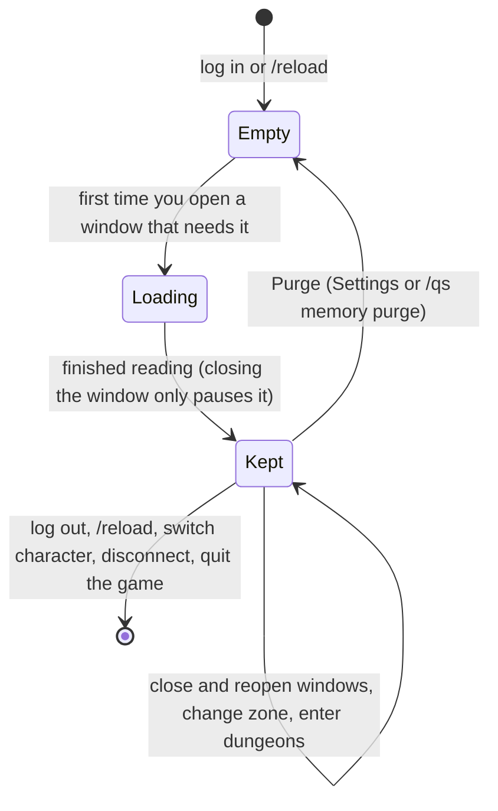

# stateDiagram-v2

Captured 2026-11-19T10:22:07.640Z - run r-20261119-112158-9efe

```mermaid
stateDiagram-v2
    [*] --> Empty : log in or /reload
    Empty --> Loading : first time you open a window that needs it
    Loading --> Kept : finished reading (closing the window only pauses it)
    Kept --> Kept : close and reopen windows, change zone, enter dungeons
    Kept --> Empty : Purge (Settings or /qs memory purge)
    Kept --> [*] : log out, /reload, switch character, disconnect, quit the game
```
