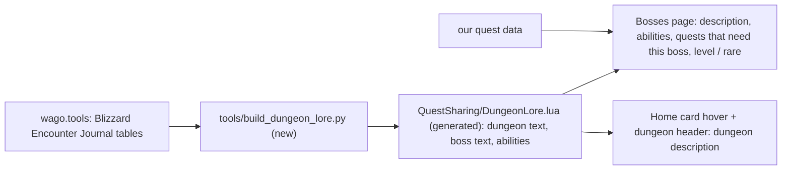

# flowchart

Captured 2026-11-20T10:43:34.985Z - run r-20261120-111056-9c21

```mermaid
flowchart LR
  W["wago.tools: Blizzard Encounter Journal tables"] --> G["tools/build_dungeon_lore.py (new)"]
  G --> L["QuestSharing/DungeonLore.lua (generated): dungeon text, boss text, abilities"]
  L --> B["Bosses page: description, abilities, quests that need this boss, level / rare"]
  L --> H["Home card hover + dungeon header: dungeon description"]
  Q["our quest data"] --> B
```
