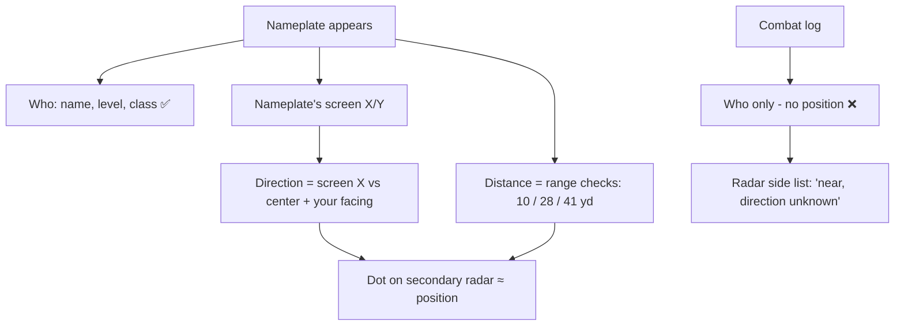

# flowchart

Captured 2026-11-20T11:47:11.396Z - run r-20261120-124656-ef75

```mermaid
flowchart TD
    NP[Nameplate appears] --> Who[Who: name, level, class ✅]
    NP --> Scr[Nameplate's screen X/Y]
    Scr --> Bear[Direction = screen X vs center + your facing]
    NP --> Rng[Distance = range checks: 10 / 28 / 41 yd]
    Bear --> Dot[Dot on secondary radar ≈ position]
    Rng --> Dot
    CL[Combat log] --> Who2[Who only - no position ❌]
    Who2 --> List[Radar side list: 'near, direction unknown']
```
