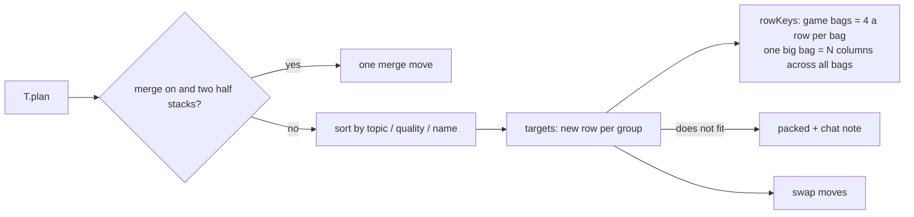

# flowchart

Captured 2026-11-20T16:29:07.943Z - run r-20261120-172246-3dc6

```mermaid
flowchart LR
    P[T.plan] --> M{merge on and two half stacks?}
    M -- yes --> MM[one merge move]
    M -- no --> O[sort by topic / quality / name]
    O --> T[targets: new row per group]
    T --> RK["rowKeys: game bags = 4 a row per bag<br/>one big bag = N columns across all bags"]
    T -- does not fit --> F[packed + chat note]
    T --> MV[swap moves]
```
