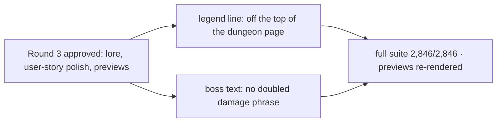

# flowchart

Captured 2026-11-20T12:02:05.074Z - run none

```mermaid
flowchart LR
  R3["Round 3 approved: lore, user-story polish, previews"] --> X1["legend line: off the top of the dungeon page"]
  R3 --> X2["boss text: no doubled damage phrase"]
  X1 --> V["full suite 2,846/2,846 · previews re-rendered"]
  X2 --> V
```
