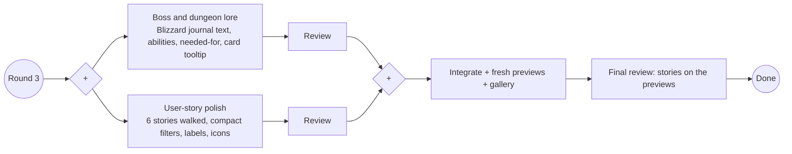

# flowchart

Captured 2026-11-20T10:49:25.182Z - run r-20261120-111056-9c21

```mermaid
flowchart LR
  S((Round 3)) --> P{+}
  P --> L[Boss and dungeon lore<br/>Blizzard journal text, abilities, needed-for, card tooltip] --> RL[Review] --> J{+}
  P --> U[User-story polish<br/>6 stories walked, compact filters, labels, icons] --> RU[Review] --> J
  J --> PV[Integrate + fresh previews + gallery] --> FR[Final review: stories on the previews] --> E((Done))
```
