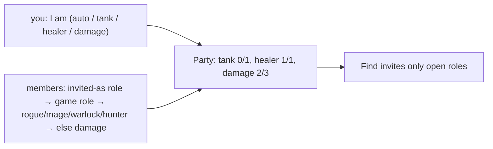

# flowchart

Captured 2026-11-20T19:02:33.199Z - run r-20261120-194708-fb95

```mermaid
flowchart LR
    Me["you: I am (auto / tank / healer / damage)"] --> Count
    Mem["members: invited-as role → game role → rogue/mage/warlock/hunter → else damage"] --> Count
    Count["Party: tank 0/1, healer 1/1, damage 2/3"] --> Find["Find invites only open roles"]
```
