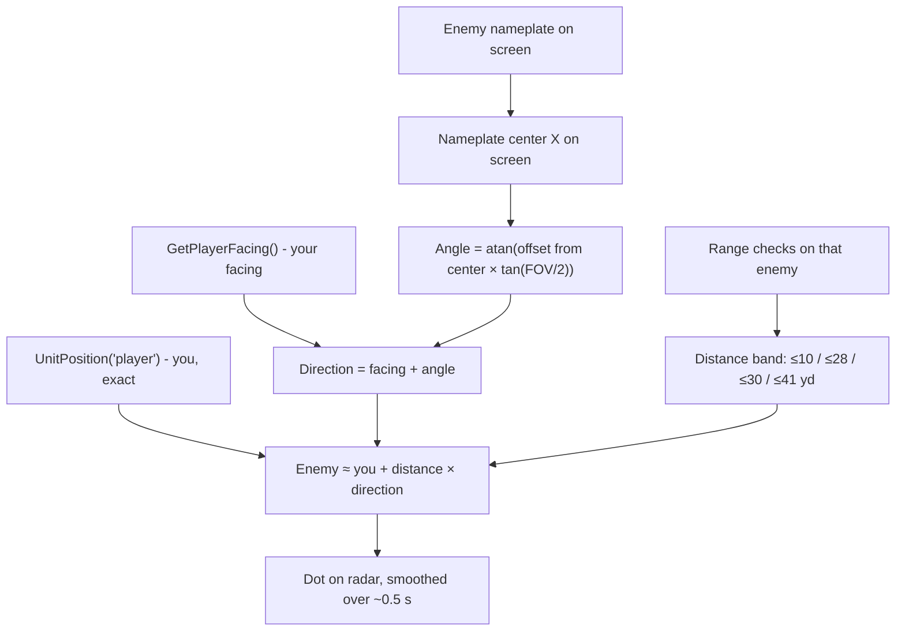

# flowchart

Captured 2026-11-20T17:10:01.883Z - run r-20261120-180942-72b0

```mermaid
flowchart TD
    A[Enemy nameplate on screen] --> B[Nameplate center X on screen]
    B --> C["Angle = atan(offset from center × tan(FOV/2))"]
    D["GetPlayerFacing() - your facing"] --> E[Direction = facing + angle]
    C --> E
    F[Range checks on that enemy] --> G["Distance band: ≤10 / ≤28 / ≤30 / ≤41 yd"]
    H["UnitPosition('player') - you, exact"] --> I["Enemy ≈ you + distance × direction"]
    E --> I
    G --> I
    I --> J[Dot on radar, smoothed over ~0.5 s]
```
