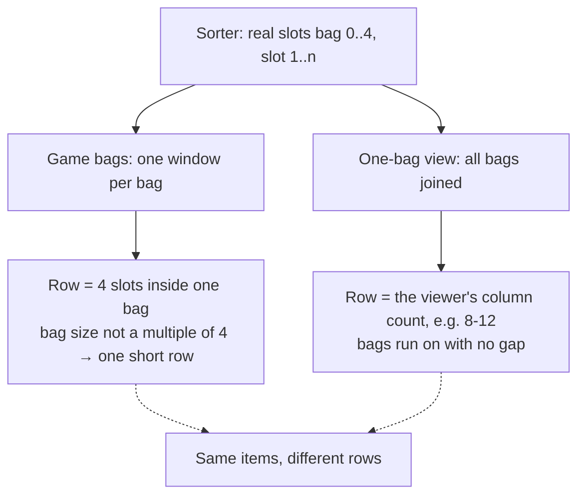

# flowchart

Captured 2026-11-20T16:21:04.169Z - run r-20261120-172034-9a5c

```mermaid
flowchart TD
    S[Sorter: real slots bag 0..4, slot 1..n] --> V1[Game bags: one window per bag]
    S --> V2[One-bag view: all bags joined]
    V1 --> R1["Row = 4 slots inside one bag<br/>bag size not a multiple of 4 → one short row"]
    V2 --> R2["Row = the viewer's column count, e.g. 8-12<br/>bags run on with no gap"]
    R1 -.-> X[Same items, different rows]
    R2 -.-> X
```
