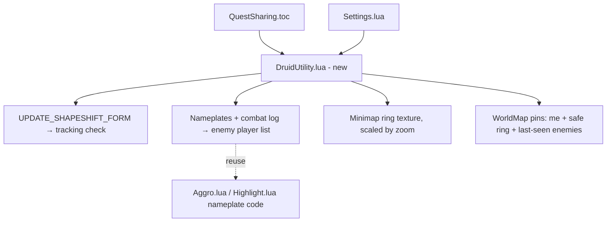

# flowchart

Captured 2026-11-20T10:58:56.502Z - run r-20261120-115812-af3e

```mermaid
flowchart TD
    Toc[QuestSharing.toc] --> DU[DruidUtility.lua - new]
    DU --> F1[UPDATE_SHAPESHIFT_FORM → tracking check]
    DU --> F2[Nameplates + combat log → enemy player list]
    DU --> F3[Minimap ring texture, scaled by zoom]
    DU --> F4[WorldMap pins: me + safe ring + last-seen enemies]
    F2 -. reuse .-> Aggro[Aggro.lua / Highlight.lua nameplate code]
    Settings[Settings.lua] --> DU
```
