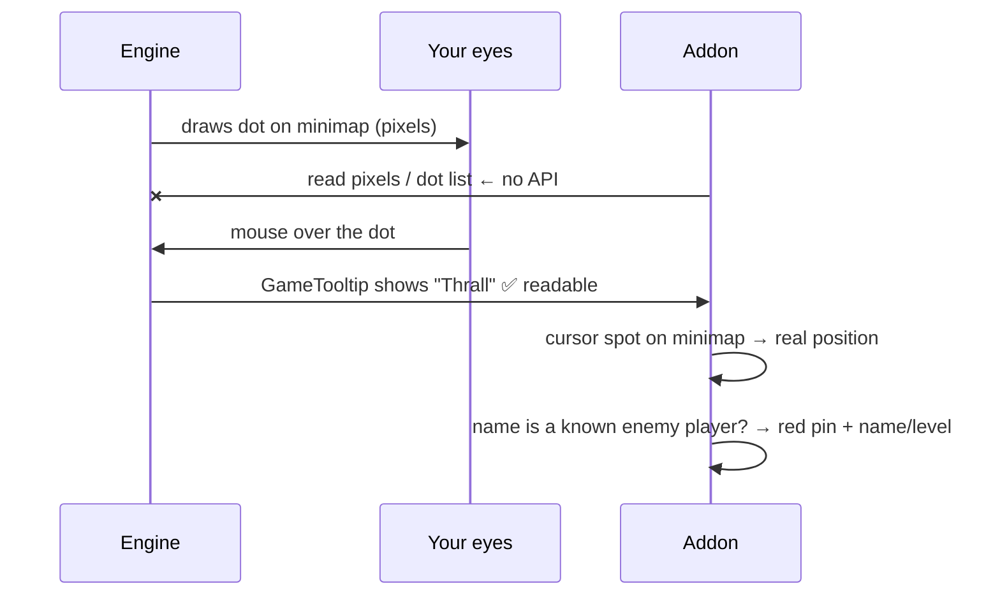

# sequenceDiagram

Captured 2026-11-20T12:44:31.566Z - run r-20261120-134418-6fa2

```mermaid
sequenceDiagram
    participant Engine
    participant You as Your eyes
    participant Addon
    Engine->>You: draws dot on minimap (pixels)
    Addon-xEngine: read pixels / dot list ← no API
    You->>Engine: mouse over the dot
    Engine->>Addon: GameTooltip shows "Thrall" ✅ readable
    Addon->>Addon: cursor spot on minimap → real position
    Addon->>Addon: name is a known enemy player? → red pin + name/level
```
