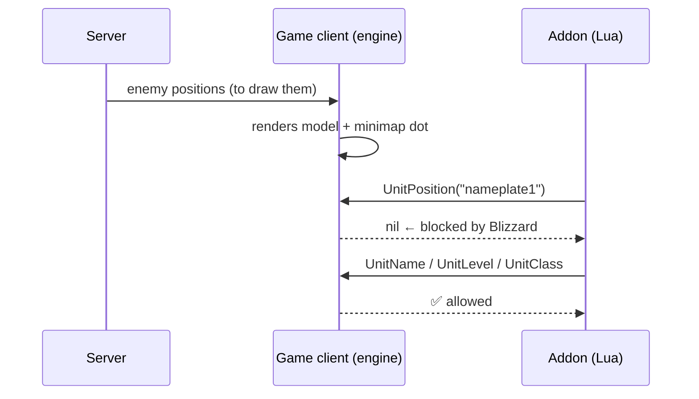

# sequenceDiagram

Captured 2026-11-20T12:43:57.059Z - run r-20261120-134348-2f6d

```mermaid
sequenceDiagram
    participant Server
    participant Client as Game client (engine)
    participant Addon as Addon (Lua)
    Server->>Client: enemy positions (to draw them)
    Client->>Client: renders model + minimap dot
    Addon->>Client: UnitPosition("nameplate1")
    Client-->>Addon: nil ← blocked by Blizzard
    Addon->>Client: UnitName / UnitLevel / UnitClass
    Client-->>Addon: ✅ allowed
```
