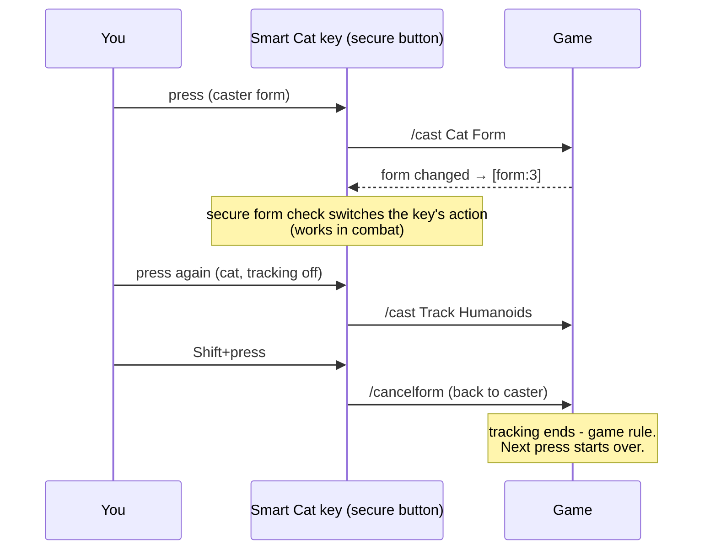

# sequenceDiagram

Captured 2026-11-20T11:01:33.511Z - run r-20261120-120105-a2a5

```mermaid
sequenceDiagram
    participant You
    participant Key as Smart Cat key (secure button)
    participant Game
    You->>Key: press (caster form)
    Key->>Game: /cast Cat Form
    Game-->>Key: form changed → [form:3]
    Note over Key: secure form check switches the key's action<br/>(works in combat)
    You->>Key: press again (cat, tracking off)
    Key->>Game: /cast Track Humanoids
    You->>Key: Shift+press
    Key->>Game: /cancelform (back to caster)
    Note over Game: tracking ends - game rule.<br/>Next press starts over.
```
