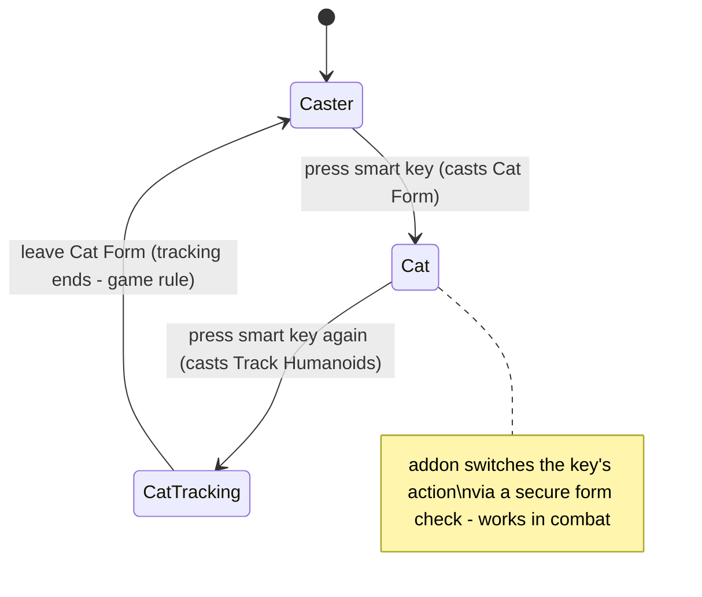

# stateDiagram-v2

Captured 2026-11-20T11:00:23.229Z - run r-20261120-115957-e023

```mermaid
stateDiagram-v2
    [*] --> Caster
    Caster --> Cat : press smart key (casts Cat Form)
    Cat --> CatTracking : press smart key again (casts Track Humanoids)
    CatTracking --> Caster : leave Cat Form (tracking ends - game rule)
    note right of Cat : addon switches the key's action\nvia a secure form check - works in combat
```
