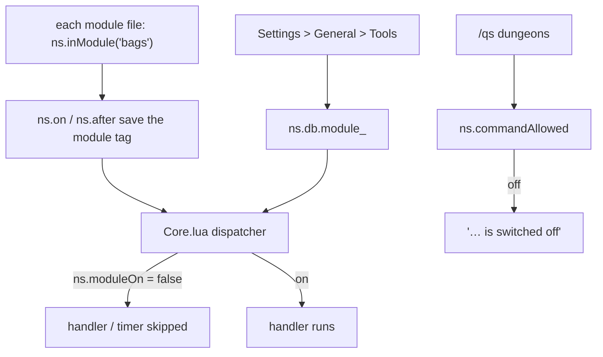

# flowchart

Captured 2026-11-21T09:26:12.007Z - run r-20261121-101717-27c3

```mermaid
flowchart TD
    File["each module file: ns.inModule('bags')"] --> On["ns.on / ns.after save the module tag"]
    On --> Disp["Core.lua dispatcher"]
    Disp -->|ns.moduleOn = false| Skip["handler / timer skipped"]
    Disp -->|on| Run["handler runs"]
    Slash["/qs dungeons"] --> Gate["ns.commandAllowed"] -->|off| Msg["'… is switched off'"]
    Settings["Settings > General > Tools"] --> Key["ns.db.module_<id>"] --> Disp
```
