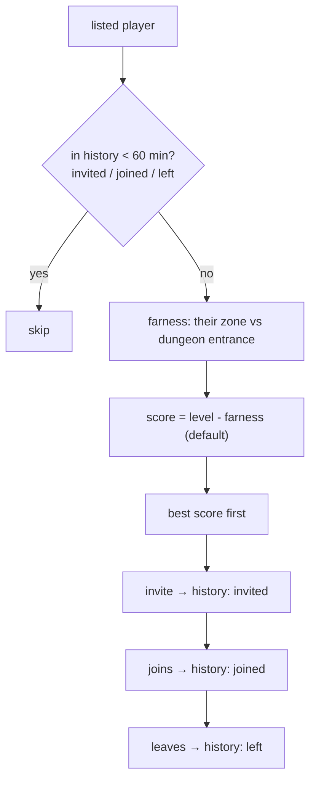

# flowchart

Captured 2026-11-21T08:34:02.618Z - run r-20261121-092644-2701

```mermaid
flowchart TD
    R[listed player] --> H{in history < 60 min?<br/>invited / joined / left}
    H -- yes --> Skip[skip]
    H -- no --> F[farness: their zone vs dungeon entrance]
    F --> S["score = level - farness (default)"]
    S --> Sort[best score first] --> Inv[invite → history: invited]
    Inv --> J[joins → history: joined] --> L[leaves → history: left]
```
