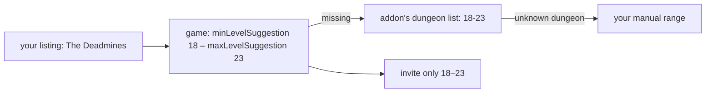

# flowchart

Captured 2026-11-21T09:28:57.091Z - run r-20261121-102216-e358

```mermaid
flowchart LR
    Q[your listing: The Deadmines] --> A["game: minLevelSuggestion 18 – maxLevelSuggestion 23"]
    A -- missing --> T["addon's dungeon list: 18-23"]
    T -- unknown dungeon --> M[your manual range]
    A --> F["invite only 18–23"]
```
