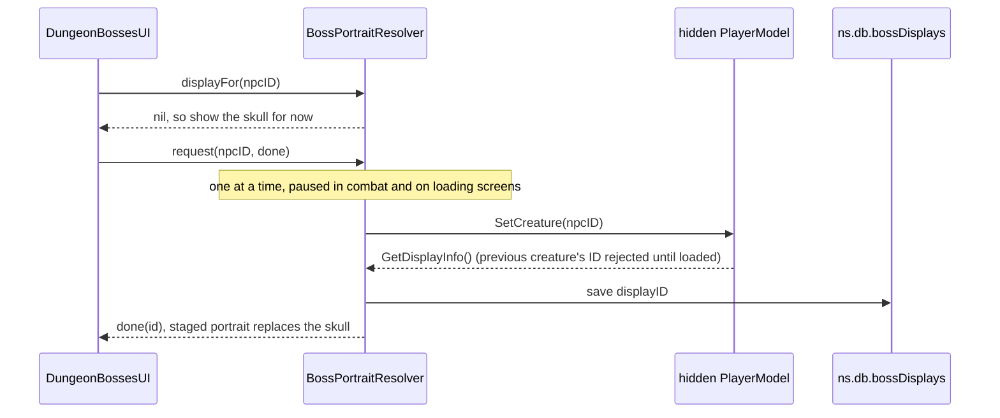

# sequenceDiagram

Captured 2026-11-21T06:48:19.732Z - run none

```mermaid
sequenceDiagram
    participant Page as DungeonBossesUI
    participant R as BossPortraitResolver
    participant M as hidden PlayerModel
    participant DB as ns.db.bossDisplays
    Page->>R: displayFor(npcID)
    R-->>Page: nil, so show the skull for now
    Page->>R: request(npcID, done)
    Note over R: one at a time, paused in combat and on loading screens
    R->>M: SetCreature(npcID)
    M-->>R: GetDisplayInfo() (previous creature's ID rejected until loaded)
    R->>DB: save displayID
    R-->>Page: done(id), staged portrait replaces the skull
```
